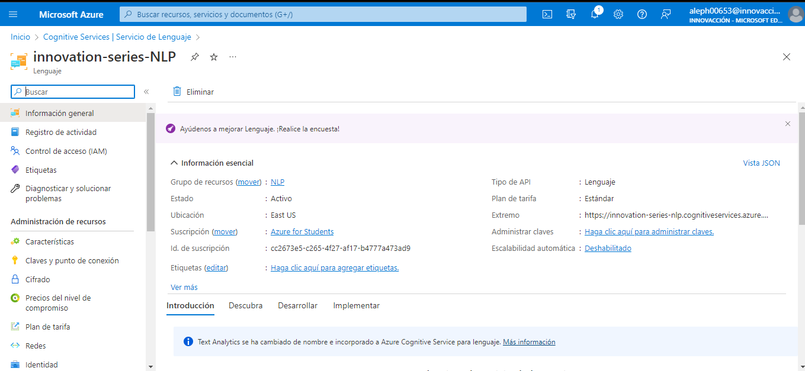
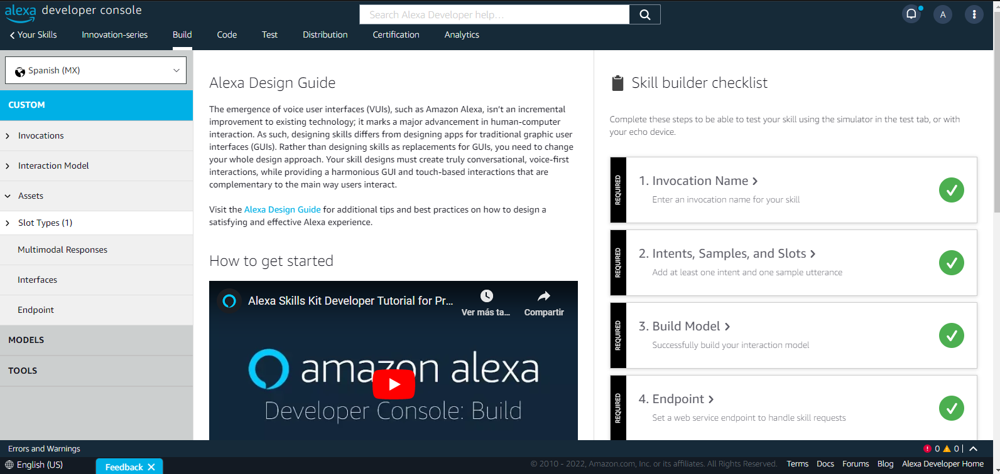
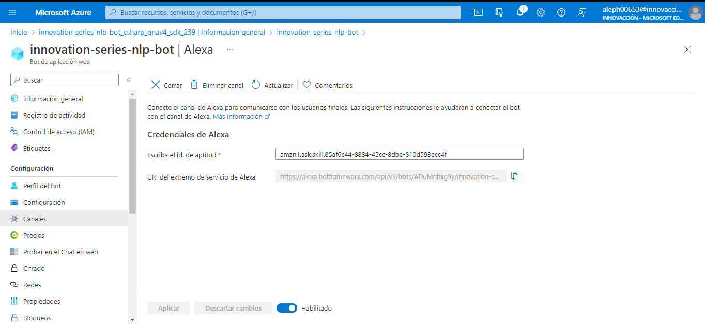
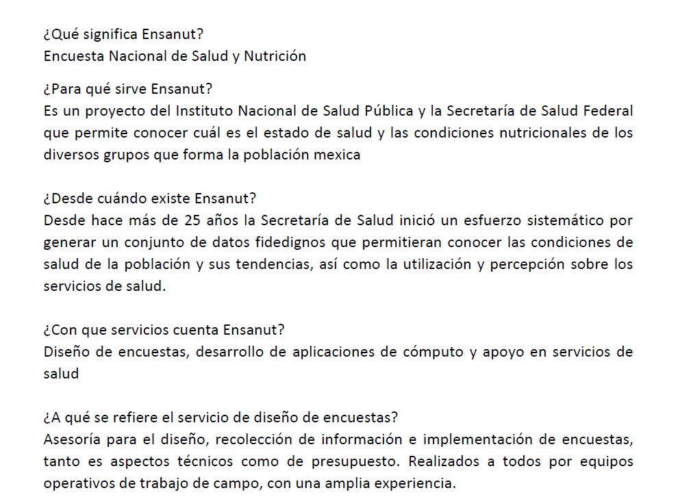

# Tecnologías utilizadas

Lo que se utilizó para crear la skill fueron las siguientes herramientas

* Azure Cognitive Services, Servicios de lenguaje 
* Alexa developer console, creación de Skill
* Bot de aplicaciones web en Azure
* Además se contruyó una base del conocimiento para que Al hacerle preguntas al asistente, personalizara las respuestas a lo que queremos

  
